Vulkan Grass Rendering
========================

**University of Pennsylvania, CIS 565: GPU Programming and Architecture, Project 6**

* Xiao Zhang
  * [LinkedIn](https://www.linkedin.com/in/xiao-zhang-674bb8148/)
* Tested on: Windows 10, i7-7700K @ 4.20GHz 16.0GB, GTX 1080 15.96GB (my own PC)

Overview 
======================

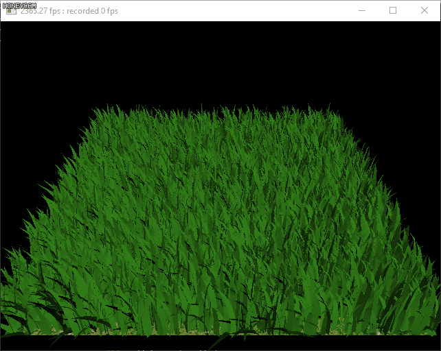

Analysis 
======================
* Compute shader WORKGROUP_SIZE is set to (32, 0, 0).

* Rendering time is measured in fps, so higher is better.

* Maximum distance for distance culling is 50.

* Frustum culling tolerance is 0.9.

* Orientation culling threshold is 0.2.

* This project is based on the paper (Responsive Real-Time Grass Rendering for General 3D Scenes
)[https://www.cg.tuwien.ac.at/research/publications/2017/JAHRMANN-2017-RRTG/JAHRMANN-2017-RRTG-draft.pdf].

---

## 1. 8192 (2^13) grass blades

### overview

### analysis

This is the bench mark configuration. From the chart, we can see that orientation culling and distance culling works better when the grass is far away from the camera and frustum culling works better when the grass is near to the camera. For orientation culling, this is because the orientation culling depends on the angle between the side direction of the grass and the direction from camera to the grass blade. So when the camera is far from the grass, this angle is smaller, meaning the side of grass is more aligned with the viewing direction, thus it's more likely to be culled. For distance culling, this is because the maximum number of grass blades that can be culled depends on the distance from the grass blade to the camera. So when the camera is far from the grass, more grass will be catogrized in a higher LOD level, thus more grass blade can be culled. For frustum culling, this is simply because none of the grass are outside the camera frustum with the far and mid configuration. However, one interesting thing is that orientation culling and frustum culling in mid distance is the slowest, where they are supposed to be in the middle. One of the reason that I can think of is the grass occupies more screen pixels because of the viewing distance is nearer, which results in longer rendering time.

### images

|      distance       |            far          |            mid          |           near           |
|:-------------------:|:-----------------------:|:-----------------------:|:------------------------:|
|    culling off      |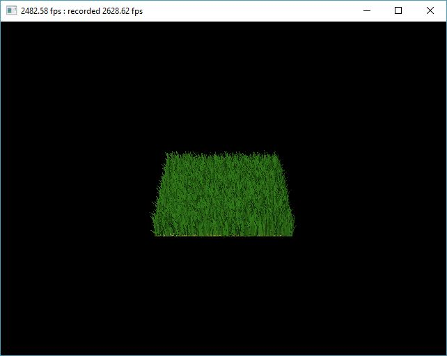|||
| orientation culling |   |   |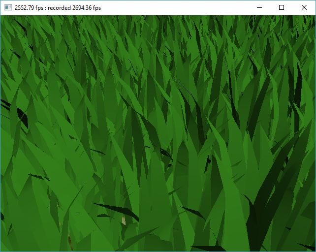   |
|   frustum culling   |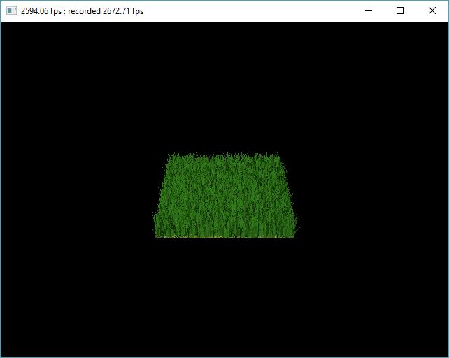   |   |   |
|   distance culling  |   |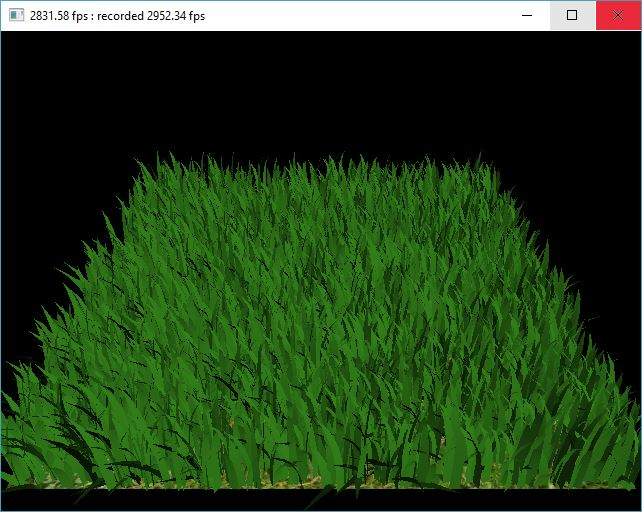   |   |
|   all culling on    |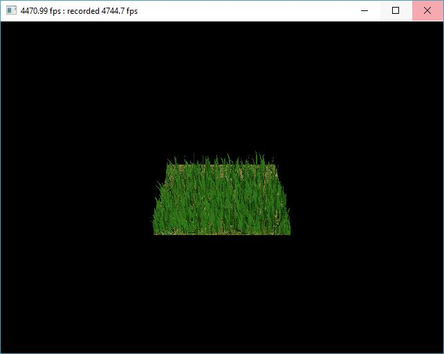 | |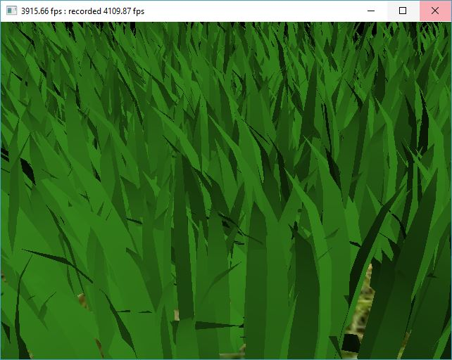 |

---

## 2. 131072 (2^17) grass blades

### overview

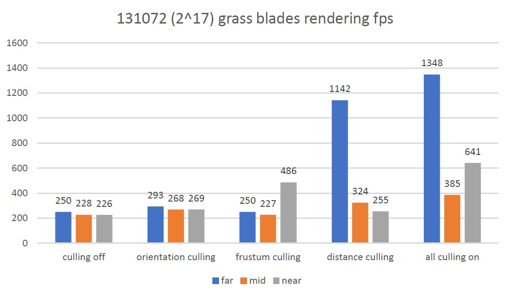

### analysis

When there are more grass blades, the rendering time is slower. But the pattern remains the same. Orientation culling and distance culling works better when the grass is far away from the camera and frustum culling works better when the grass is near to the camera.

### images

|      distance       |            far          |            mid          |           near           |
|:-------------------:|:-----------------------:|:-----------------------:|:------------------------:|
|    culling off      ||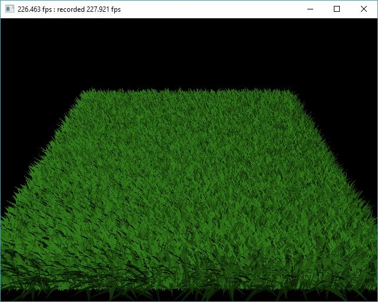|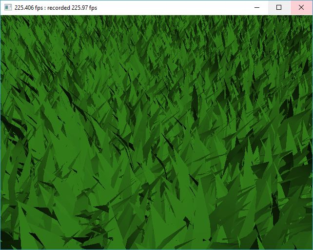|
| orientation culling |   |   |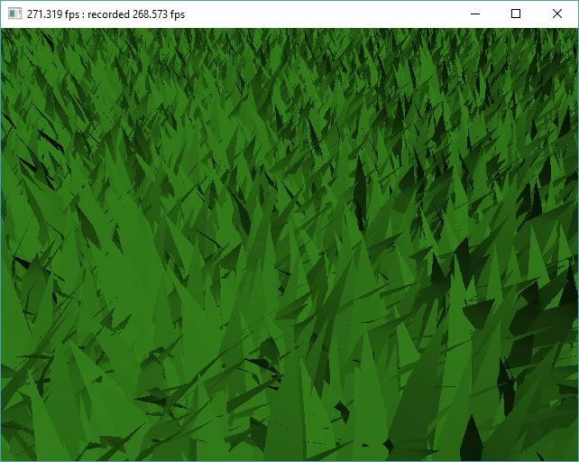   |
|   frustum culling   |   |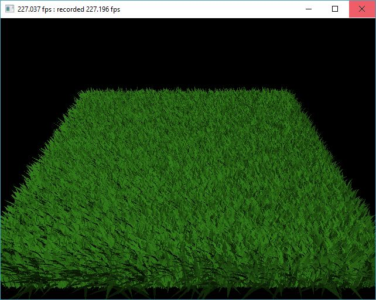   |   |
|   distance culling  |   |   |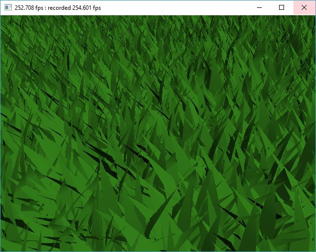   |
|   all culling on    | |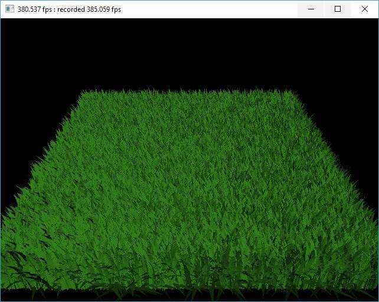 | |

---

## 3. 2097152 (2^21) grass blades

### overview

### analysis

When there are much more grass blades, the rendering time is much slower. But the pattern remains the same. Orientation culling and distance culling works better when the grass is far away from the camera and frustum culling works better when the grass is near to the camera. Among all the three culling options, the performance change in distance culling due to distance is the most significent, even though the performance change for the other two culling options is mellowed out because of the large number of grass blades. This is mostly becuase the distance culling algorithm is the most progressive one, meaning the standard is the lest strict which can result in a lot of grass blades getting culled.

### images

|      distance       |            far          |            mid          |           near           |
|:-------------------:|:-----------------------:|:-----------------------:|:------------------------:|
|    culling off      |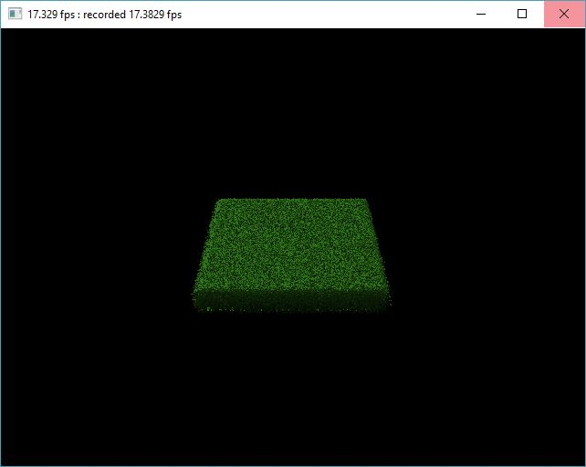|||
| orientation culling |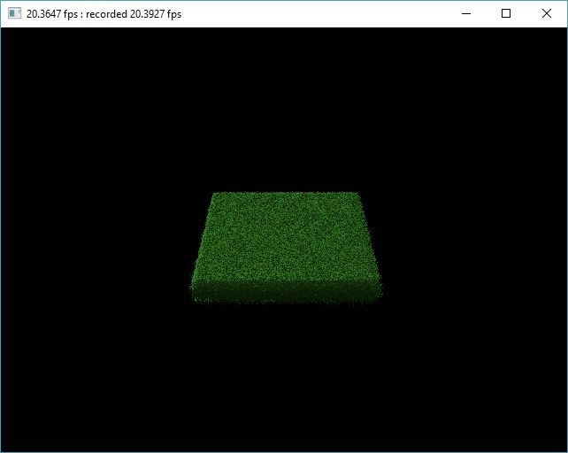   |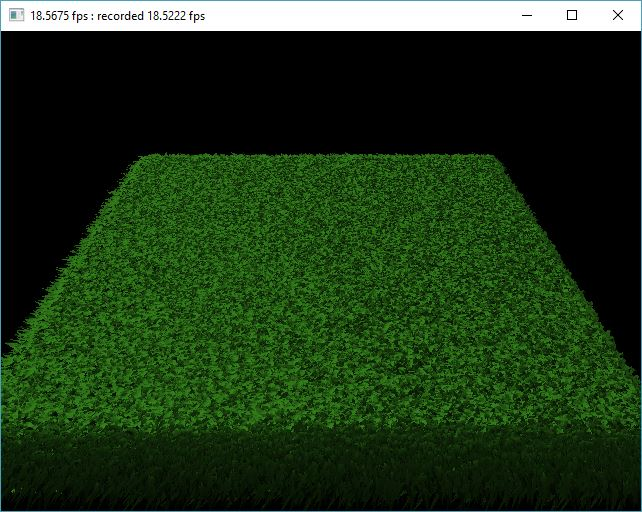   |   |
|   frustum culling   |   |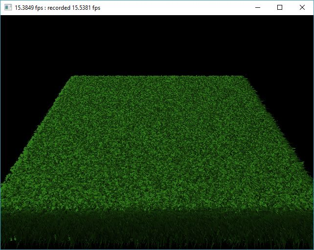   |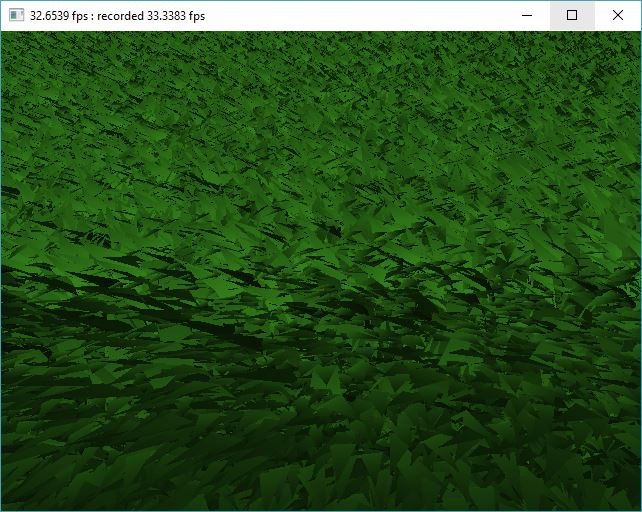   |
|   distance culling  |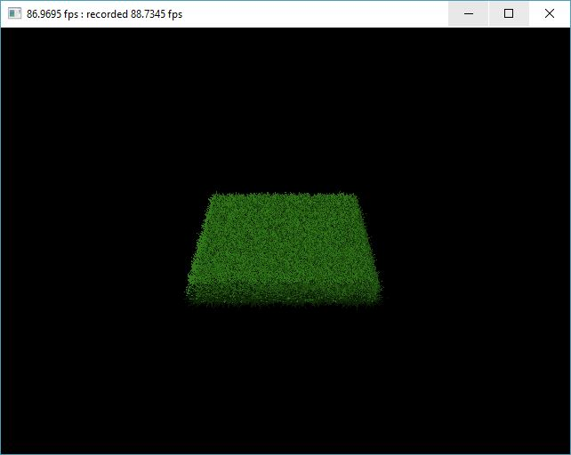   |   |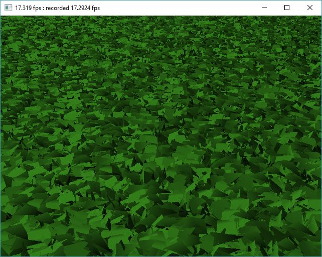   |
|   all culling on    | | | |

---
